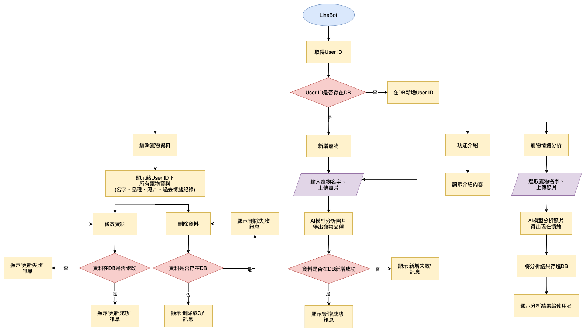

# LineBot Project

## 專案結構

.  
├── readme.md   
├── app.py   
├── database.py   
├── handlers.py   
├── templates.py  
├── utils.py  
├── tests   
│   ├── app_test.py  
│   ├── handler_test.py  
├── tesks   
│   ├── richmenu
│   ├── train_model  
└── statics

- `app.py`：主要程式碼，初始化 Flask 應用程式。
- `handler.py`：設定 Webhook、設定 Handler 等，用於處理收到的訊息，並回應相應的內容。
- `templates`：包含 Line Bot 所使用的樣板訊息，例如文字訊息、圖片訊息、按鈕訊息等。
- `statics`：包含靜態資源，如 圖片 和 JSON 檔案。
- `database.py`：包含處理資料庫的邏輯，例如存儲使用者資訊、設定等。
- `readme.md`：應用程式的說明文件，包括如何安裝、配置和運行應用程式。
- `utils.py`：包含一些輔助函式，例如爬蟲、發送 API 請求等。
- `tests/`：包含測試程式碼，例如測試資料庫、測試事件處理邏輯等。
- `tasks/`：包含自動更新richmenu、訓練模型等個別執行程式。

## 如何使用

1. 從github下載此專案。
2. 匯入db
3. 需自行新增secret.env檔，設定三個系統變數CHANNEL_ACCESS_TOKEN,CHANNEL_SECRET,WEBHOOK_URL
4. 執行app.py 
4. ngrok http 8080

## 相關連結

- [Line Developers](https://developers.line.biz/en/)
- [Flask](https://flask.palletsprojects.com/en/2.0.x/)
- [LineBot SDK](https://github.com/line/line-bot-sdk-python)